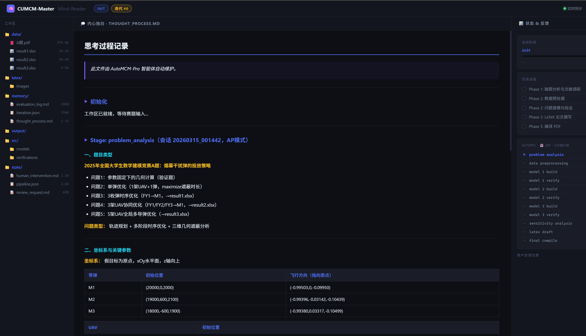
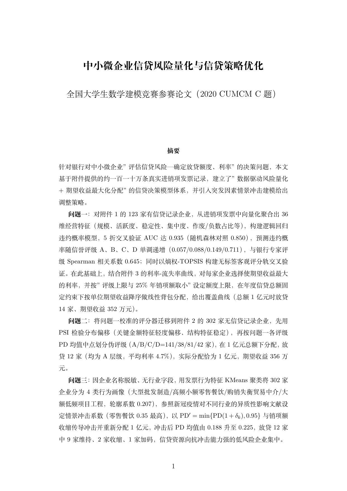
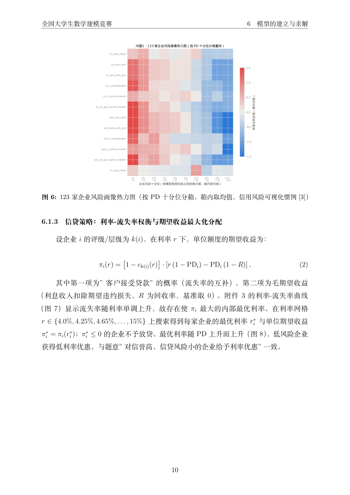
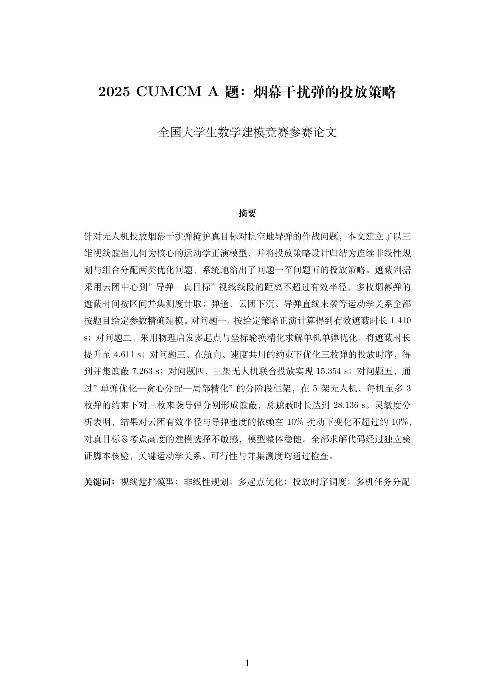
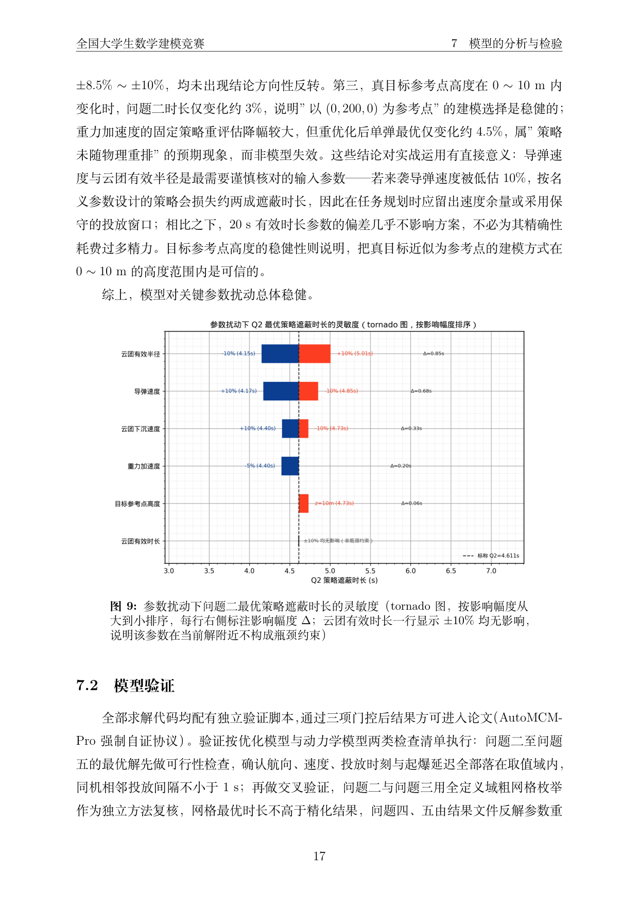

# AutoMCM-Pro

> 重新定义人机协作边界：AI Coding Agent 担任 Autopilot（自动驾驶仪），人类担任 Copilot

[](#多-runtime-支持)
[](LICENSE)
[](demo/)
[](CHANGELOG.md)

---

## 动机与愿景

随着生成式人工智能的快速发展，数学建模竞赛中越来越多的环节可以被 AI 承接——文献检索、数学推导、代码实现、LaTeX 排版，乃至完整的论文写作。这一趋势在推动效率提升的同时，也引发了一个根本性问题：

> **当 AI 能够独立完成大部分工作时，"人机协作"的边界应该划在哪里？**

本项目的出发点，正是跨越这条边界的一次试验。

传统模式中，AI 是工具，人类是决策者。参赛者主导所有环节，AI 仅作为 Copilot（副驾驶）辅助执行。**AutoMCM-Pro 反转了这个关系**：Claude Code 智能体承担 **Autopilot（自动驾驶仪）** 的角色，自主驱动整条建模流水线——从解读赛题、搜索文献、构建数学模型、编写并自证求解代码，到最终生成完整的 LaTeX 论文；**人类退居 Copilot 位置**，在关键节点介入审阅、提供战略性指导，或在需要时完全接管某个环节的决策权。

这种模式并非让人类"袖手旁观"，而是将人类的精力集中在 AI 难以替代的部分：
- **判断建模方向是否符合题意与现实物理**
- **发现模型假设中的潜在缺陷**
- **提供领域直觉与经验性修正**

  

---

## 这个 Skill 能做什么

`/auto-mcm`、`/cumcm-master` 和 `/mcm-master` 三个 Skill 共同构成一条从零到论文的全自动建模流水线，覆盖：

| 阶段 | AI 完成的工作 |
|------|--------------|
| **题目解读** | 读取 PDF/文本题目，识别问题类型、约束、数据特征 |
| **文献调研** | 联网搜索相关建模方法，提炼文献依据，记录 DOI |
| **数据预处理** | 编写并运行 EDA 脚本，生成数据分布图，完成缺失值/异常值处理 |
| **模型构建** | 选择数学工具（优化/微分方程/统计/图论），编写求解代码，运行至无误 |
| **强制自证** | 为每个求解脚本配写独立验证脚本，覆盖约束满足、物理合理性、数值稳定性 |
| **敏感性分析** | 分析关键参数扰动对结果的影响，验证模型鲁棒性 |
| **LaTeX 论文** | 按竞赛格式（国赛/美赛模板）逐章撰写，插入图表，完成引用 |
| **PDF 编译** | 调用 xelatex/pdflatex 编译，输出最终 PDF |
| **AI 图像生成** | 调用 OpenAI gpt-image-2 生成算法流程图、架构图和概念插图（需 API Key 或 Codex 订阅） |

整个过程完全在本地运行，所有中间状态通过 `state/pipeline.json` 持久化，支持中断续做。

---

## AP / MANUAL 双模式

### AP 模式（Autopilot — 自动驾驶）

AI 完全自主推进，每个阶段完成后立即写入自评报告并自动前进到下一阶段。人类可随时查看 `state/review_request.md` 中的自评记录，但不需要主动操作。

**适用场景**：时间紧迫时快速出解，或对 AI 能力充分信任的情况。

### MANUAL 模式（手动规格驱动）

AI 在开始核心建模之前会暂停，等待人类在 `human_intervention.md` 中填写精确的数学规格（模型类型、决策变量、目标函数、约束条件、求解器）。之后 AI 100% 按照该规格实现，不自行添加任何内容。每个阶段完成后同样需要人类填写 `[APPROVED]` 才能继续。

**适用场景**：人类已有明确建模思路，需要精确控制模型细节；或希望对每个阶段保持严格的人工审核。

### 混用策略

两种模式可在同一次竞赛中组合使用：数据预处理阶段用 AP 快速完成，核心建模阶段切换至 MANUAL 确保数学严谨性。

---

## 核心机制

### GitOps 流水线状态机

每个阶段的状态通过 `state/pipeline.json` 持久化，形成类似 CI/CD 的审查流程：

```
not_started → in_progress → pending_review → approved
                                           ↘ rework → in_progress（重做）
```

可随时运行 `python scripts/pipeline_manager.py status` 查看完整状态看板。

### 强制代码自证（Mandatory Self-Verification）

所有求解代码（`src/models/`）都必须配有对应的验证脚本（`src/verifications/verify_*.py`）。验证内容包括：
- 目标函数值与约束满足性核验
- 边界条件与物理可行性检查
- 数值稳定性与收敛性验证

**所有验证项必须全部通过（`✓ PASS`），结果才能被引用进论文。** 任何 `✗ FAIL` 都会强制回退到模型构建阶段。

### 五层建模质量门控

在 verify 通过之外，v0.2.0 新增五层质量检查，减少"代码运行了但结果是错的"的可能性：

| 门控 | 内容 |
|------|------|
| **文献质量** | 每个子问题至少 2 篇学术文献支撑模型选择，否则不得开始编码 |
| **数值合理性** | 自动检查决策变量范围、目标值量级、有无 `inf`/`nan`，任一异常回退 |
| **验证报告格式** | `verify_*.py` 必须输出结构化 `PASS/FAIL` 报告，流水线程序化解析 |
| **LaTeX 编译重试** | 编译失败时自动解析错误行号并修复，最多 3 次，仍失败才请求人工介入 |
| **多问题一致性** | 并行模式下，所有子问题完成后统一检查物理常数和数据来源是否一致 |

### 安全机制

| 机制 | 说明 |
|------|------|
| **Markdown 注入防护** | 用户提供的文本在写入 pipeline 状态文件前自动脱敏，防止伪造 `[APPROVED]`/`[REWORK]` 控制标记 |
| **返工上限** | 默认每阶段最多返工 5 次，超出后暂停等待人工介入，防止无限循环（`--max-reworks N` 可调整） |
| **密钥提交拦截** | 竞赛 Git 提交前扫描暂存区，检测到 OpenAI key、GitHub token 等模式时自动阻止提交 |
| **历史记录保护** | `[APPROVED]`/`[REWORK]` 标记替换采用 `count=1`，保留完整审查历史，不覆盖旧记录 |
| **JSON 损坏恢复** | `pipeline.json` 解析失败时给出明确错误信息和恢复建议，不崩溃退出 |

### Mind-Reader 实时思维可视化

基于 FastAPI + WebSocket 的实时 Web UI（`http://localhost:8080`），渲染 AI 在 `memory/thought_process.md` 中记录的推理过程，支持 KaTeX 数学公式、代码高亮和流水线进度看板。


**启动方式**：

```bash
# 方式一：Docker（docker-compose.yml 已有的服务，需要本机装 Docker）
docker compose up mind-reader

# 方式二：原生启动（不需要 Docker，Agent 可以自己检测依赖、按需安装并启动，
# 很多沙盒化 runtime 环境里没有 Docker，这条路径就是为此准备的）
python scripts/launch_mind_reader.py --check   # 只检查依赖
python scripts/launch_mind_reader.py           # 后台启动，打印 URL 后立即返回
python scripts/launch_mind_reader.py --workspace /path/to/CUMCM_Workspace --port 8090
```

2026-08 更新：文件监听改为递归（不再漏掉 `memory/ledgers/`、`state/messages/` 这类
子目录里的 Los Alamos 产物），并新增"更多动态"面板——`worklog.md`/`citations.bib`
有专属展示，其余任何未来新增的文件类型即使前端没有针对性 UI，也会通过通用兜底
广播出现在这个面板里，不会因为前端代码没跟上就在界面上彻底消失。

### AI 图像生成（`/draw-image`）

v0.2.0 新增 `/draw-image` Skill，调用 OpenAI **gpt-image-2** 为论文自动生成流程图、系统架构图和概念插图。该 Skill 仅用于**非数值内容**的图像——数据驱动的图表仍由 Python 代码生成，以保证可重现性。

**默认行为**（无需任何配置即可判断）：

| 环境 | 行为 |
|------|------|
| 已安装 OpenAI Codex 并 OAuth 登录 | ✅ **自动开启** — 通过 `$imagegen` 生成，不消耗 API 额度 |
| 设置了 `OPENAI_API_KEY` | ✅ 开启 — 通过 OpenAI API 生成（按 token 计费） |
| 两者均未配置 | ⏭ **默认关闭** — 自动跳过，LaTeX 留占位符，**流水线不中断** |

> 使用 Codex（ChatGPT Plus/Pro 订阅）时，图像生成无需任何额外配置，**开箱即用**。  
> 未使用 Codex 时，功能默认关闭——不会报错，只是在论文中留下 `\missingfigure{}` 占位符。

```bash
# 检查当前认证状态（不产生任何费用）
python scripts/draw_image.py --check

# 生成一张算法流程图
python scripts/draw_image.py \
  --prompt "Clean flowchart: 读取题目 → 建模 → 验证 → LaTeX, white background" \
  --output CUMCM_Workspace/latex/images/fig00_pipeline.png \
  --quality high
```

### 多 Agent 并行流水线

初始化时加 `--problems N` 即可开启 AP 模式多 Agent 并行。流水线在 `data_preprocessing` 完成后自动判断并行时机，无需手动干预：

```bash
# 开启 AP 多 Agent 并行（3 个子问题）
python scripts/pipeline_manager.py init --mode AP --contest CUMCM --problems 3

# 流水线自动在正确时机建议并行阶段
python scripts/pipeline_manager.py suggest-parallel
# 输出示例：model_1_build model_2_build model_3_build
```

主 Agent 拿到 `suggest-parallel` 的输出后，在**同一条消息**里同时启动 N 个子 Agent，各自负责一个子问题的完整 build → verify → self-approve 流程，彼此完全独立。全部完成后主 Agent 通过 `parallel-all-done` 检查，再进入灵敏度分析。

手动控制命令（也可直接使用）：
```bash
python scripts/pipeline_manager.py parallel-start    model_1_build model_2_build model_3_build
python scripts/pipeline_manager.py parallel-status   model_1_verify model_2_verify model_3_verify
python scripts/pipeline_manager.py parallel-all-done model_1_verify model_2_verify model_3_verify
```

### 竞赛工作区版本控制

初始化时加 `--git` 后，流水线在每次 `advance`（阶段通过）时自动提交快照，支持多轮迭代历史追踪与草稿对比：

```bash
# 开启版本控制 + 多 Agent 并行（3 个子问题）
python scripts/pipeline_manager.py init --mode AP --contest CUMCM --choice A --problems 3 --git

# 查询历史 / 对比草稿
python scripts/pipeline_manager.py contest-git log
python scripts/pipeline_manager.py contest-git diff draft-v1 draft-v2
python scripts/pipeline_manager.py contest-git status
python scripts/pipeline_manager.py contest-git tag final-v2 "第二轮修改后最终版"
```

竞赛 Git 仓库位于 `CUMCM_Workspace/.git`，与 AutoMCM-Pro 工具仓库完全独立。  
`latex_draft` approved → 自动打 `draft-v1` tag；`final_compile` approved → 自动打 `final-v1` tag。

### Los Alamos 探索层与治理 Addon

叠加在主流水线（内部代号 **Project Apollo**）之上的可选层，详细设计见
[`LOS_ALAMOS_DESIGN.md`](LOS_ALAMOS_DESIGN.md)，完整规范见 [`AutoMCM_SOP.md`](AutoMCM_SOP.md)：

| Addon | 灵感来源 | 做什么 | 默认触发方式 |
|---|---|---|---|
| **Los Alamos** | 曼哈顿计划的多假设并行探索 | 同一子问题存在真实建模范式分歧时，展开多个假设分支各自 build+verify，经红队复核后走熵权-TOPSIS（客观量化）+ 判审团两两比较（定性）双轨裁决 | Director 自主判断（题目要求比较方法 / 题目复杂度初判 / 文献发现多范式等 6 条准则） |
| **RAND Delphi** | 兰德公司德尔菲法 | Track 2 判审团分歧过高时，先跑最多 2 轮匿名收敛，收敛了就不用升级人类终审 | 分歧熵超阈值自动触发 |
| **Project Skunk Works** | 洛克希德臭鼬工厂 | 轻量快速模式：文献门槛降到 ≥1 篇、Checkpoint 报告更简短；§4 强制代码自证不放宽 | 人类明确要求，或 Director 判断时间预算紧迫时自主触发（触发前必须先告知） |
| **Andon Cord** | 丰田生产方式 | 任意角色发现根本性问题时可拉绳，硬阻断 `advance` 直到人工确认解除 | 任意时刻手动 |
| **NASA Go/No-Go** | 阿波罗任务发射前检查 | `final_compile` 前强制轮询 5-6 个"分系统"（Andon/阶段完整性/图片/占位符/匿名性/假设 ledger），全绿才放行 | 强制，无法跳过 |
| **Project Kaizen** | 丰田持续改善 | 结果已验证正确但主动判断"还能不能更好"，四维度自评（显著性/稳健性/假设合理性/论证完整性），最多打磨 2 轮 | 均分未达标且时间预算允许时自主触发 |

配套工具：
- **工作日志**（`scripts/worklog.py`）——单文件、简体中文、完整记录用户消息/Agent 决策/门控结果，阶段推进等大部分内容自动写入，零额外 token 成本
- **文献真实性核验**（`scripts/cite_check.py`）——DOI 用 CrossRef API 核验是否真实存在，不只是检查"像不像引用"；跨子问题共享去重的 `citations.bib`
- **写作风格打磨**（`scripts/style_check.py`）——六项客观指标降低"AI 生成感"（列表堆砌、套话、机械过渡骨架、句长/段落长度均匀度、跨章节短语重复），不靠模糊的"读起来自然点"

### 多 Runtime 支持

同一套协议（`AutoMCM_SOP.md`）在四个 coding agent runtime 上都有绑定，均通过真实执行任务验证（非文档推断）：

| Runtime | 绑定文件 | 详情 |
|---|---|---|
| Claude Code | `.claude/skills/auto-mcm/SKILL.md` | 权威完整版，其余三份均交叉引用它 |
| DeepSeek Harness（dsh） | `.dsh/skills/auto-mcm/SKILL.md` | [`DSH_INTEGRATION.md`](DSH_INTEGRATION.md) |
| opencode | `.opencode/skills/auto-mcm/SKILL.md` | [`OPENCODE_INTEGRATION.md`](OPENCODE_INTEGRATION.md) |
| OpenAI Codex CLI | `.agents/skills/auto-mcm/SKILL.md` | [`CODEX_INTEGRATION.md`](CODEX_INTEGRATION.md) |

### 官方格式合规

`AutoMCM_SOP.md` §17：论文模板已同步《全国大学生数学建模竞赛论文格式规范
（2026年修订稿）》与 MCM/ICM（COMAP）官方规则；`quality_gate.py anon-check`
做匿名性启发式检查；`scripts/ai_usage_doc.py` 按各自赛制官方格式生成 AI 工具
使用声明（CUMCM 的独立 PDF支撑材料 / MCM 的 `Report on Use of AI Tools` 章节），
取材于工作日志、不自动插入论文——**AutoMCM-Pro 不对使用者怎么用这份工具做限定，
但"核心建模与分析必须由参赛队独立完成"这条规则是使用者自己需要把握的边界**。

---

## 如何使用

### 第一步：安装 Skill（一次性）

```bash
git clone https://github.com/RealSeaberry/AutoMCM-Pro
cd AutoMCM-Pro
bash install.sh
```

安装完成后，`/auto-mcm`、`/cumcm-master`、`/mcm-master` 三个命令在任意目录的 Claude Code 会话中均可使用。

### 第二步：把工作目录拷贝到竞赛目录

```bash
cp -r AutoMCM-Pro /path/to/my-contest-2025
cd /path/to/my-contest-2025
```

> 题目文件和数据不需要提前放置，Agent 会在对话中询问路径。

### 第三步：启动skill

```bash
claude        # 启动 Claude Code
/auto-mcm     # 呼叫 Skill
```

**之后全部用自然语言交流，无需输入任何命令行。**

---

#### AP 模式——AI 全自动，零命令交互示例

```
你：这是今年国赛 B 题，题目在 ./problem.pdf，数据在 ./data/ 目录。帮我做。

AI：读取题目中……检测到 3 个子问题，将开启多 Agent 并行建模 + 竞赛版本控制。
    ✓ 工作区已就绪（AP 模式 | 3 并行 Agent | Git 已开启）。开始建模！

    ……（AI 全程自动运行，每完成一个阶段主动汇报）……

    ✓ 数据预处理完成，保留 231 条记录，生成分布图 3 张。
      → 同时启动问题一、二、三建模（3 个 Agent 并行）。

    ✓ 问题一（非线性规划）验证全通过 | 问题二（ODE）验证全通过 | 问题三（回归）验证全通过。
      → 开始灵敏度分析。

    ✓ 论文草稿完成，已提交快照 draft-v1。开始编译 PDF……
      → 最终论文：CUMCM_Workspace/output/final_paper.pdf

你：问题二的模型假设再严格一点，补充一条。

AI：已理解，正在修改问题二的模型假设章节……（rework 自动执行）
    ✓ 修改完成，已重新编译。版本快照：final-v2。
```

---

#### MANUAL 模式——每步等你拍板，也是自然语言

```
你：MANUAL 模式，我想控制每步的建模细节。

AI：好的，我先读题……数据预处理完成。问题一我计划用 SLSQP 非线性规划，
    目标函数 max T_shield(θ,v)，你确认吗？还是有其他想法？

你：把约束改成 v ∈ [80, 130]。

AI：明白，已更新约束。开始编码……（后续相同）
```

---

## Demo：两个真实国赛题（DeepSeek Harness 全自动跑通）

> **说明**：以下两个案例都是真实官方赛题（不是虚构案例），流水线全程在 **DeepSeek Harness（dsh）headless 模式**下一次性自动跑完唤醒协议→数据处理→建模验证→灵敏度分析→论文撰写→编译，过程中**没有任何人类确认节点**（headless 模式不挂载人类问答工具，AP 模式全程自评自批）。全部人类输入只有启动时的一条任务提示词。完整产物见 [`demo/`](demo/) 目录，`demo/2020C/` 和 `demo/2025A/` 各自独立。

### 一个诚实的补充说明：为什么不能直接采信 Agent 的"完成报告"

两次 demo 都用了同一套 dsh 流水线，但 dsh 当时跑的模型（`deepseek-v4-flash`）**不支持图像输入**——它自称做了"可视化自我审查"，实际只能做像素/文件层面的程序化检查，从没有真正**看过**一张图。2025A 案例第一轮产出的可视化质量确实不理想；2020C 案例跑完后，我们没有直接相信完成报告，而是用有视觉能力的 Claude Code 把全部 21 张图逐一复核，真的发现了 2 处实质 bug（单类目堆叠柱状图退化成一整块纯色矩形）和 1 处配色误用（相关系数矩阵错用单向渐变色而非发散色板），定位到源码后直接修正、重新出图、重新编译，页数和结论数字保持不变。这个"自动跑完 → 有视觉能力的 Agent 复核 → 定点修正"的循环，我们认为比"一次性全自动零干预"更诚实地反映了当前多 Agent、多模型协作的真实局限。

### 2020 年国赛 C 题：中小微企业的信贷决策

原始附件约 **110 万行**发票明细，从 `mcm.edu.cn` 官网下载核验，真实数据非虚构。

- **问题一**：对附件 1 中 123 家有信贷记录企业，从约 37 万条发票中向量化聚合出 39 维经营特征，训练逻辑回归违约概率模型（5 折 CV AUC **0.935**，随机森林对照 0.850），预测违约概率随信誉评级 A/B/C/D 严格单调（0.057/0.088/0.149/0.711），与银行专家评级 Spearman 相关系数 **0.645**；年度信贷总额 1 亿元时，按期望收益最大化分配给 14 家企业，期望收益 352 万元。
- **问题二**：把问题一校准的评分器迁移到附件 2 中 302 家无信贷记录企业（约 73 万条发票），PSI 检验分布偏移、按 PD 分层映射伪评级，1 亿元总额下放贷 12 家（均为最优层级），期望收益 356 万元。
- **问题三**：用发票行为特征对 302 家企业做 KMeans 聚类，画出 4 类企业的发票行为画像（雷达图），叠加新冠疫情式突发冲击的行业异质性系数，给出信贷调整策略。
- 全部三问代码验证 **11/11、13/13、13/13** 全通过，灵敏度分析 **12/12** 通过；最终论文 **30 页（正文 21 页）**，18 张图全部是 2D 图表（热力图、雷达图、tornado 图、按额度排序的条形图等），零 3D 图——按 SOP §18"画图前先查这类问题的常规可视化方式"的新规则执行。

产物见 `demo/2020C/`（原始的两份大体量发票附件因文件过大未随仓库提交，题目原文 `.docx` 与全部衍生特征/结果 CSV 已保留）：论文 [`final_paper_2020C_credit_decision.pdf`](demo/2020C/CUMCM_Workspace/output/final_paper_2020C_credit_decision.pdf)、`demo/2020C/CUMCM_Workspace/memory/thought_process.md`。




### 2025 年国赛 A 题：烟幕干扰弹的投放策略（NASA 技术报告风格可视化）

无人机投放烟幕干扰弹掩护真目标对抗来袭导弹的三维视线遮挡几何问题，五个递进子问题。

- **问题一**：给定策略正演计算，有效遮蔽时长 **1.410 s**。
- **问题二**：放开航向/速度/投放时刻/起爆延迟四个自由度做单弹优化，物理启发多起点+坐标轮换精化，提升至 **4.611 s**（+227%）。
- **问题三**：单机三弹投放时序优化，并集遮蔽 **7.263 s**。
- **问题四**：三机协同各投一弹，并集遮蔽 **15.354 s**。
- **问题五**：5 架无人机、每机至多 3 枚弹，对 3 枚来袭导弹分阶段分配（单弹优化→贪心分配→局部精化），总遮蔽时长 **28.136 s**。
- 全部代码验证通过，灵敏度分析显示模型对关键参数（导弹速度、云团有效半径）总体稳健；论文 **28 页（正文 20 页）**。

这个案例的可视化经过了三轮迭代：dsh 第一版效果不理想 → 人工用 `fit3d_axes` 等工具修复 3D 视角留白/文字压字问题 → 按用户要求改造成 **NASA 技术报告/轨道力学图风格**（白底、密集细网格+加粗主网格、黑白主线条、NASA Blue `#0B3D91`/NASA Red `#FC3D21` 只用于关键标注，四边完整描边），全部 9 张图统一重绘，建模结论数字全程未变。

产物见 `demo/2025A/`：论文 [`final_paper_2025A_smoke_screen.pdf`](demo/2025A/CUMCM_Workspace/output/final_paper_2025A_smoke_screen.pdf)、`demo/2025A/CUMCM_Workspace/memory/thought_process.md`。




---

## 安装

### 前置条件

- [Claude Code](https://claude.ai/code) 已安装（`claude` CLI 可用）
- Python 3.10+
- 基础依赖：`pip install pdfplumber scipy numpy matplotlib pandas openpyxl`
- 可选：TeX Live 或 MiKTeX（LaTeX 编译，也可用 Docker 替代）
- **若要编译 MCM/ICM 模板**（`templates/mcm_template.tex`）：额外需要 `mcmthesis` 宏包（`tlmgr install mcmthesis`，或见 [mcmthesis 项目](https://github.com/latexstudio-org/mcmthesis)）——多数 TeX Live 精简安装默认不带，CUMCM 模板不需要这条
- 可选（AI 图像生成）：`pip install openai>=1.0` + `OPENAI_API_KEY` 环境变量，或 OpenAI Codex 订阅

### 安装命令

```bash
git clone https://github.com/RealSeaberry/AutoMCM-Pro
cd AutoMCM-Pro
bash install.sh          # 符号链接安装（推荐，git pull 自动更新）
bash install.sh --copy   # 文件拷贝安装（无 git 环境）
bash install.sh --check  # 检查安装状态
```

### 更新

```bash
cd AutoMCM-Pro
git pull   # 符号链接安装下，Skill 自动生效，无需重装
```

### 卸载

```bash
bash uninstall.sh
```

---

## 项目结构

```
AutoMCM-Pro/
├── .claude/skills/               # Claude Code 绑定（权威完整版）
│   ├── auto-mcm/SKILL.md        # 统一入口（AP/MANUAL 双模式，含多 Agent 并行策略）
│   ├── cumcm-master/SKILL.md    # 国赛专用
│   ├── mcm-master/SKILL.md      # 美赛专用
│   └── draw-image/SKILL.md      # AI 图像生成（gpt-image-2，含 Codex OAuth 支持）
├── .dsh/skills/auto-mcm/         # DeepSeek Harness 绑定
├── .opencode/skills/auto-mcm/    # opencode 绑定
├── .agents/skills/auto-mcm/      # Codex CLI 绑定
├── AutoMCM_SOP.md                # 操作准则（Skill 行为的最终权威，§1~§17）
├── LOS_ALAMOS_DESIGN.md / _INTEGRATION.md / _METHOD_CATALOG.md  # 探索层设计与方法库
├── DSH_INTEGRATION.md / OPENCODE_INTEGRATION.md / CODEX_INTEGRATION.md  # 三个 runtime 绑定背景
├── CHANGELOG.md                  # 版本变更记录
├── install.sh / uninstall.sh     # 安装/卸载
├── init_gitops.sh                # 交互式初始化引导
├── docker-compose.yml            # 容器化环境（Python + TeX Live）
├── scripts/
│   ├── pipeline_manager.py      # GitOps 状态机 CLI（含并行/contest-git/andon/kaizen）
│   ├── contest_git.py           # 竞赛工作区版本控制（CUMCM_Workspace/.git）
│   ├── draw_image.py            # OpenAI gpt-image-2 图像生成（含 Codex 认证检测）
│   ├── quality_gate.py          # 建模质量门控 CLI（文献/数值/验证/一致性/匿名/发射前检查等）
│   ├── cite_check.py            # 文献真实性核验（CrossRef API）+ 共享引用池
│   ├── style_check.py           # 写作风格打磨：降低"AI 生成感"六项客观检查
│   ├── worklog.py               # 工作日志：单文件简体中文完整记录
│   ├── ai_usage_doc.py          # AI 工具使用声明生成（CUMCM/MCM 各自官方格式）
│   ├── security_check.py        # 安全检查：路径遍历/密钥泄露/工作区扫描（CLI）
│   ├── plot_style.py            # 统一图表风格：中文字体自动检测 + 色盲安全配色 + 印刷级 DPI
│   ├── compile_pdf.py           # 跨平台 LaTeX 编译（含页数统计与超标提醒）
│   ├── setup_workspace.py       # 工作区目录初始化
│   ├── launch_mind_reader.py    # 原生启动 Mind-Reader（不需要 Docker）
│   ├── agent_memory_manager.py  # 记忆管理工具
│   └── los_alamos/              # 可选探索层 addon：多假设并行建模 + 双轨裁决（见 LOS_ALAMOS_DESIGN.md）
├── templates/
│   ├── latex_template.tex       # CUMCM 论文模板（已同步 2026 官方格式规范）
│   ├── mcm_template.tex         # MCM/ICM 论文模板（mcmthesis，已同步 COMAP 规则）
│   └── mcm_memo_template.tex    # MCM 实用性文件模板（单页 Memo）
├── demo/                        # 两个真实赛题完整演示产物（dsh headless 全自动）
│   ├── 2020C/                   # 2020国赛C题：中小微企业的信贷决策
│   └── 2025A/                   # 2025国赛A题：烟幕干扰弹的投放策略（NASA风格可视化）
└── CUMCM_Workspace/             # 运行时工作目录（每次竞赛独立拷贝）
    ├── data/                    # 赛题与数据文件
    ├── src/models/              # 求解代码
    ├── src/verifications/       # 验证脚本（强制配套）
    ├── latex/                   # LaTeX 源文件与图表
    ├── memory/                  # 思考过程/推理链/工作日志/引用池
    ├── state/                   # GitOps 流水线状态
    └── output/                  # 最终 PDF、AI 使用声明与结果表格
```

---

## LaTeX 编译

```bash
# 本地编译（需已安装 TeX Live 或 MiKTeX）
python scripts/compile_pdf.py                    # CUMCM
python scripts/compile_pdf.py --mode mcm --memo  # MCM + Memo

# Docker 编译（无需本地 LaTeX）
docker-compose up -d cumcm-agent
docker exec -it cumcm-agent python scripts/compile_pdf.py
```

---

## License

MIT License — 欢迎 Fork、二次开发和 Pull Request。

---
---

# AutoMCM-Pro

> Redefining Human-AI Collaboration: Claude Code as Autopilot, Humans as Copilot

---

## Motivation

As generative AI rapidly advances, an increasing share of math modeling competition tasks can be delegated to AI: literature search, mathematical derivation, code implementation, LaTeX typesetting, and even full paper writing. This raises a fundamental question:

> **When AI can independently handle most of the work, where should the boundary of human-AI collaboration be drawn?**

AutoMCM-Pro is an experiment in crossing that boundary.

In the traditional model, AI is a tool and humans are decision-makers. Competitors lead every step, with AI acting as a Copilot. **AutoMCM-Pro inverts this relationship**: the Claude Code agent takes the **Autopilot** role, autonomously driving the entire modeling pipeline — from interpreting the problem, searching literature, building mathematical models, writing and self-verifying solver code, to generating the complete LaTeX paper. **Humans step into the Copilot seat**, intervening at key checkpoints to review, provide strategic guidance, or take full control of specific decisions when needed.

This is not about humans "stepping aside." It's about concentrating human effort where it's irreplaceable:
- Judging whether the modeling direction aligns with the problem's intent and physical reality
- Spotting flaws in model assumptions
- Providing domain intuition and empirical corrections

---

## What This Skill Does

Three Skills — `/auto-mcm`, `/cumcm-master`, and `/mcm-master` — form a complete zero-to-paper automated pipeline:

| Stage | What the AI Does |
|-------|-----------------|
| **Problem Reading** | Reads PDF/text problem, identifies problem type, constraints, data characteristics |
| **Literature Research** | Searches the web for relevant modeling methods, extracts references |
| **Data Preprocessing** | Writes and runs EDA scripts, generates distribution plots, handles missing/outlier values |
| **Model Building** | Selects mathematical tools (optimization/ODE/statistics/graph theory), writes solver code |
| **Self-Verification** | Writes an independent verification script for each solver: constraints, physical feasibility, numerical stability |
| **Sensitivity Analysis** | Analyzes how key parameter perturbations affect results, validates robustness |
| **LaTeX Paper** | Writes chapter by chapter in competition format (CUMCM or MCM template), inserts figures, completes citations |
| **PDF Compilation** | Compiles with xelatex/pdflatex, outputs the final PDF |
| **AI Image Generation** | Uses OpenAI gpt-image-2 to generate algorithm flowcharts, architecture diagrams, and conceptual illustrations (requires API Key or Codex subscription) |

The entire process runs locally. All intermediate state is persisted via `state/pipeline.json`, supporting pause and resume.

---

## AP / MANUAL Dual Modes

### AP Mode (Autopilot)

The AI runs fully autonomously, completing each stage and then immediately writing a self-evaluation report and advancing to the next stage. Humans can review `state/review_request.md` at any time but are not required to act.

**Best for**: Time-constrained competitions, rapid prototyping, or when you trust the AI to handle the full run.

### MANUAL Mode (Specification-Driven)

Before starting core modeling, the AI pauses and waits for the human to fill in a precise mathematical specification in `human_intervention.md` (model type, decision variables, objective function, constraints, solver). The AI then implements exactly that specification — no autonomous extensions. Each stage also requires a human `[APPROVED]` to continue.

**Best for**: When you have a clear modeling strategy and want precise control; or when you want strict human review at every checkpoint.

### Mixing Modes

The two modes can be combined within a single competition: AP mode for fast data preprocessing, then MANUAL for the critical modeling stages.

---

## Core Mechanisms

### GitOps Pipeline State Machine

Each stage's status is persisted in `state/pipeline.json`, forming a CI/CD-like review flow:

```
not_started → in_progress → pending_review → approved
                                           ↘ rework → in_progress (redo)
```

Run `python scripts/pipeline_manager.py status` at any time to see the full status dashboard.

### Mandatory Self-Verification

All solver code (`src/models/`) must be paired with a corresponding verification script (`src/verifications/verify_*.py`), covering:
- Objective function value and constraint satisfaction
- Boundary conditions and physical feasibility
- Numerical stability and convergence

**All verification checks must pass (`✓ PASS`) before results can be cited in the paper.** Any `✗ FAIL` forces a rollback to the model-building stage.

### Five-Layer Modeling Quality Gates

Beyond pass/fail verification, v0.2.0 adds five quality checkpoints that catch "code ran but results are wrong":

| Gate | What it checks |
|------|---------------|
| **Literature quality** | ≥ 2 academic references per sub-problem supporting the model choice; no coding until satisfied |
| **Numerical sanity** | Decision variable ranges, objective value magnitude, absence of `inf`/`nan`; any anomaly triggers rollback |
| **Structured verification output** | `verify_*.py` must print a machine-parseable `PASS/FAIL` report; pipeline parses it programmatically |
| **LaTeX auto-retry** | On compile failure, automatically locates the error line and attempts repair up to 3 times before asking for help |
| **Cross-problem consistency** | In parallel mode, after all verifies complete: checks that physical constants and data sources are unified across sub-problems |

### Security

| Mechanism | Description |
|-----------|-------------|
| **Markdown injection prevention** | User-provided text is sanitized before being written to pipeline state files, preventing forged `[APPROVED]`/`[REWORK]` control markers |
| **Rework limit** | Default 5 reworks per stage; exceeded → pipeline pauses for human intervention, preventing infinite loops (`--max-reworks N` to adjust) |
| **Secret commit interception** | Contest Git scans staged files before every commit; blocks and warns if OpenAI keys, GitHub tokens, or other credential patterns are detected |
| **History preservation** | Marker replacement uses `count=1` — each approval/rework leaves a timestamped record; prior reviews are never overwritten |
| **Corruption recovery** | Malformed `pipeline.json` produces a clear error with recovery instructions instead of a silent crash |

### Mind-Reader Real-Time Visualization

A FastAPI + WebSocket web UI at `http://localhost:8080` renders the AI's thought process from `memory/thought_process.md` in real time, with KaTeX math, code highlighting, and a pipeline progress dashboard.

**Launch options**:

```bash
# Option 1: Docker (the docker-compose.yml service, requires Docker locally)
docker compose up mind-reader

# Option 2: Native (no Docker needed — an Agent can detect deps, install them
# on demand, and launch it itself; many sandboxed runtime environments don't
# have Docker, and this path exists for exactly that case)
python scripts/launch_mind_reader.py --check   # dependency check only
python scripts/launch_mind_reader.py           # background launch, prints URL and returns
python scripts/launch_mind_reader.py --workspace /path/to/CUMCM_Workspace --port 8090
```

2026-08 update: file watching is now recursive (no longer misses Los Alamos
artifacts under `memory/ledgers/` or `state/messages/`), and a new "More
Activity" panel shows a generic fallback feed — `worklog.md`/`citations.bib`
get dedicated displays, and any future new file type still surfaces here
through a generic broadcast even without bespoke frontend code.

### AI Image Generation (`/draw-image`)

New in v0.2.0: the `/draw-image` skill calls OpenAI **gpt-image-2** to generate flowcharts, architecture diagrams, and conceptual illustrations. It is intentionally limited to **non-data figures** — data-driven charts are still generated by Python code to ensure reproducibility.

**Default behavior** (auto-detected, no configuration needed to know which applies):

| Environment | Behavior |
|-------------|----------|
| OpenAI Codex installed and signed in via OAuth | ✅ **Auto-enabled** — uses `$imagegen`, no API credits consumed |
| `OPENAI_API_KEY` set | ✅ Enabled — uses OpenAI API (token-based billing) |
| Neither configured | ⏭ **Disabled by default** — skips silently, leaves `\missingfigure{}` placeholder, **pipeline continues** |

> If you use Codex (ChatGPT Plus/Pro subscription), image generation works out of the box — **no extra setup required**.  
> Without Codex, the feature is off by default — it never errors out, it just leaves placeholders in your paper.

```bash
python scripts/draw_image.py --check   # check auth without generating anything
```

### Multi-Agent Parallel Pipeline (AP Mode)

Add `--problems N` to `init` to enable automatic AP multi-agent parallelism. The pipeline detects the right moment to parallelize — no manual intervention needed:

```bash
# Enable AP multi-agent parallel for 3 sub-problems
python scripts/pipeline_manager.py init --mode AP --contest CUMCM --problems 3

# Pipeline auto-suggests the next batch of parallel stages
python scripts/pipeline_manager.py suggest-parallel
# Example output: model_1_build model_2_build model_3_build
```

In Claude Code, the orchestrator Agent calls `suggest-parallel` after `data_preprocessing` is approved, then launches N sub-Agents simultaneously in a single message — each handles one sub-problem's complete build → verify → self-approve cycle independently. The orchestrator advances to sensitivity analysis only after `parallel-all-done` exits 0.

Manual control commands (also available for custom orchestration):
```bash
python scripts/pipeline_manager.py parallel-start    model_1_build model_2_build model_3_build
python scripts/pipeline_manager.py parallel-status   model_1_verify model_2_verify model_3_verify
python scripts/pipeline_manager.py parallel-all-done model_1_verify model_2_verify model_3_verify
```

### Contest Workspace Version Control

Add `--git` to `init` to enable an independent Git repo inside `CUMCM_Workspace/` that auto-snapshots at every pipeline stage approval — enabling multi-round draft comparison and rollback:

```bash
# Enable version control + multi-agent parallel (3 sub-problems)
python scripts/pipeline_manager.py init --mode AP --contest CUMCM --choice A --problems 3 --git

# Query history / compare drafts
python scripts/pipeline_manager.py contest-git log
python scripts/pipeline_manager.py contest-git diff draft-v1 draft-v2
python scripts/pipeline_manager.py contest-git tag final-v2 "post-revision final"
```

The `CUMCM_Workspace/.git` repo is fully independent from the AutoMCM-Pro tool repo.  
`latex_draft` approved → auto-tag `draft-v1`; `final_compile` approved → auto-tag `final-v1`.

### Los Alamos Exploration Layer & Governance Addons

An optional layer stacked on top of the main pipeline (internal codename
**Project Apollo**); full design in [`LOS_ALAMOS_DESIGN.md`](LOS_ALAMOS_DESIGN.md),
full spec in [`AutoMCM_SOP.md`](AutoMCM_SOP.md):

| Addon | Inspired by | What it does | Default trigger |
|---|---|---|---|
| **Los Alamos** | Manhattan Project's parallel multi-hypothesis exploration | When a sub-problem has genuine modeling-paradigm disagreement, spawns multiple hypothesis branches to build+verify independently, red-team-reviewed, then dual-track adjudicated (objective entropy-weight+TOPSIS vs. qualitative pairwise judge panel) | Director's autonomous judgment (6 criteria: explicit request / problem-complexity initial judgment / literature finds multiple paradigms / etc.) |
| **RAND Delphi** | RAND Corporation's Delphi method | When Track 2 judge-panel disagreement is too high, runs up to 2 anonymous convergence rounds before escalating to human sign-off | Auto, when disagreement entropy exceeds threshold |
| **Project Skunk Works** | Lockheed's Skunk Works | Lightweight mode: citation bar drops to ≥1, shorter Checkpoint reports; §4 mandatory self-verification is never relaxed | Explicit human request, or Director's autonomous judgment under a genuine time-pressure signal (must announce before switching) |
| **Andon Cord** | Toyota Production System | Any role can pull it on discovering a fundamental problem, hard-freezing `advance` until a human clears it | Manual, any time |
| **NASA Go/No-Go** | Apollo pre-launch poll | Mandatory 5–6-subsystem poll (Andon / stage completeness / images / placeholders / anonymity / Los Alamos assumption ledger) before `final_compile` | Mandatory, cannot be skipped |
| **Project Kaizen** | Toyota's continuous improvement | After results are already verified correct, self-assesses whether they could still be better on 4 dimensions (significance / robustness / assumption soundness / argument completeness); up to 2 polish rounds | Autonomous, when score is below target and time budget allows |

Supporting tools:
- **Work log** (`scripts/worklog.py`) — single-file, Simplified Chinese, complete
  record of user messages / Agent decisions / gate results; most of it
  auto-logged at zero extra token cost
- **Citation authenticity verification** (`scripts/cite_check.py`) — DOIs
  verified via the CrossRef API (catches hallucinated citations, not just
  format-shape matching); a shared, deduplicated `citations.bib` across
  sub-problems
- **Writing-style polish** (`scripts/style_check.py`) — six objective checks
  to reduce "AI-generated feel" (list-heavy narrative, stock phrases,
  mechanical transition skeletons, sentence/paragraph-length uniformity,
  cross-section phrase repetition) — not a vague "make it sound more natural"

### Multi-Runtime Support

The same protocol (`AutoMCM_SOP.md`) is bound to four coding-agent runtimes,
each verified via real executed tasks (not documentation inference):

| Runtime | Binding file | Details |
|---|---|---|
| Claude Code | `.claude/skills/auto-mcm/SKILL.md` | Canonical full version; the other three cross-reference it |
| DeepSeek Harness (dsh) | `.dsh/skills/auto-mcm/SKILL.md` | [`DSH_INTEGRATION.md`](DSH_INTEGRATION.md) |
| opencode | `.opencode/skills/auto-mcm/SKILL.md` | [`OPENCODE_INTEGRATION.md`](OPENCODE_INTEGRATION.md) |
| OpenAI Codex CLI | `.agents/skills/auto-mcm/SKILL.md` | [`CODEX_INTEGRATION.md`](CODEX_INTEGRATION.md) |

### Official Format Compliance

`AutoMCM_SOP.md` §17: paper templates are synced to the official《全国大学生
数学建模竞赛论文格式规范（2026年修订稿）》and the MCM/ICM (COMAP) rules;
`quality_gate.py anon-check` does a heuristic anonymity scan;
`scripts/ai_usage_doc.py` generates AI-tool-usage disclosures in each
contest's own official format (a standalone PDF for CUMCM, a `Report on Use
of AI Tools` section for MCM/ICM), sourced from the work log and never
auto-inserted into the paper — **AutoMCM-Pro does not dictate how you use
this tool, but the rule that "core modeling and analysis must be completed
independently by the team" is a boundary the user needs to own.**

---

## How to Use

### Step 1: Install (one-time)

```bash
git clone https://github.com/RealSeaberry/AutoMCM-Pro
cd AutoMCM-Pro
bash install.sh
```

After installation, `/auto-mcm`, `/cumcm-master`, and `/mcm-master` are available in any Claude Code session from any directory.

### Step 2: Copy the working directory for your contest

```bash
cp -r AutoMCM-Pro /path/to/my-contest-2025
cd /path/to/my-contest-2025
```

> No need to place files or run any setup commands — the agent asks for file paths in natural language.

### Step 3: Just talk

```bash
claude
/auto-mcm
```

**Everything after this is natural language. No command-line input required.**

---

#### AP Mode — Fully Autonomous, Zero-Command Example

```
You:  This is the CUMCM 2025 Problem B. The PDF is at ./problem.pdf and
      data is in ./data/. Please handle everything.

AI:   Reading the problem… detected 3 sub-problems. Enabling multi-agent
      parallel mode + version control.
      ✓ Workspace ready (AP mode | 3 parallel agents | Git enabled). Starting!

      … (AI runs autonomously, reporting after each stage) …

      ✓ Data preprocessing done — 231 records retained, 3 distribution plots generated.
        → Launching Problems 1, 2, 3 in parallel (3 agents).

      ✓ Problem 1 (NLP) all verifications passed
        Problem 2 (ODE) all verifications passed
        Problem 3 (regression) all verifications passed
        → Starting sensitivity analysis.

      ✓ Draft complete — snapshot tagged draft-v1. Compiling PDF…
        → Final paper: CUMCM_Workspace/output/final_paper.pdf

You:  Tighten the assumptions for Problem 2 — add one more constraint.

AI:   Understood. Updating Problem 2 model assumptions…  (rework runs silently)
      ✓ Done and recompiled. New snapshot: final-v2.
```

---

#### MANUAL Mode — You Approve Each Step, Still in Natural Language

```
You:  MANUAL mode — I want to control the modeling approach.

AI:   Got it. After reading the problem and preprocessing data, here's my
      proposed plan for Problem 1: objective max T_shield(θ,v),
      variables θ∈[0°,360°] and v∈[70,140] m/s, solver SLSQP. Confirm?

You:  Change the speed range to [80, 130].

AI:   Updated. Starting implementation…
```

---

## Demo: Two Real Contest Problems — Fully Autonomous on DeepSeek Harness

> Both cases below are real official contest problems (not synthetic). Each pipeline ran end-to-end — wake protocol → data processing → modeling/verification → sensitivity analysis → paper drafting → compilation — in a single **DeepSeek Harness (dsh) headless** run with **zero human checkpoints** during execution (headless mode has no human-question tool mounted; AP mode self-reviews every checkpoint). The complete human input was a single task prompt at launch. Full artifacts are in [`demo/`](demo/), with `demo/2020C/` and `demo/2025A/` as independent cases.

### An honest caveat: why we can't just take the agent's completion report at face value

Both demos used the same dsh pipeline, but the model dsh was running (`deepseek-v4-flash`) **has no image-input support** — it claimed to have done "visual self-review" of the charts, but that could only ever be a file/pixel-level programmatic check; it never actually *looked* at a single image. The 2025A case's first-pass charts weren't good; for the 2020C case, instead of trusting the completion report, we had vision-capable Claude Code review all 21 generated figures directly, and found 2 real bugs (single-category stacked bar charts collapsing into a solid-color rectangle) plus 1 colormap misuse (a signed correlation matrix rendered with a one-directional gradient instead of a diverging palette). Both were traced to source and fixed, figures regenerated, PDF recompiled — page count and every reported number stayed the same. We think this "run fully autonomously → have a vision-capable agent verify → fix at the source" loop is a more honest picture of current multi-agent, multi-model limitations than a "one-shot, zero-intervention" narrative would be.

### CUMCM 2020 Problem C: Credit Strategy for Small and Micro Enterprises

Original attachments: **~1.1 million** real invoice records, downloaded and verified from `mcm.edu.cn`, not synthetic.

- **Problem 1**: for the 123 credit-history enterprises in Attachment 1, vectorized aggregation over ~370K invoices into 39 features, then a logistic-regression default-probability model (5-fold CV AUC **0.935**, vs. 0.850 for a random-forest baseline). Predicted PD is strictly monotone across credit ratings A/B/C/D (0.057/0.088/0.149/0.711), Spearman ρ = **0.645** against the bank's expert ratings. At a ¥100M total credit budget, expected-profit-maximizing allocation lends to 14 enterprises for ¥3.52M expected profit.
- **Problem 2**: transfers the Problem-1-calibrated scorer to the 302 credit-history-free enterprises in Attachment 2 (~730K invoices), checks distribution shift via PSI, maps pseudo-ratings from PD tiers; at ¥100M total, lends to 12 enterprises (all top-tier) for ¥3.56M expected profit.
- **Problem 3**: KMeans-clusters the 302 enterprises by invoice-behavior features into 4 profiles (radar chart), layers on industry-heterogeneous shock coefficients modeling a COVID-style disruption, and produces an adjusted credit strategy.
- All three sub-problems' verification passed **11/11, 13/13, 13/13**; sensitivity analysis passed **12/12**. The final paper is **30 pages (21-page body)** with 18 figures, all 2D (heatmaps, radar chart, tornado chart, sorted bar charts, etc.) — zero 3D plots, following SOP §18's rule to research the conventional visualization form for a problem type before drawing anything.

Artifacts in `demo/2020C/` (the two large raw invoice attachments aren't checked in due to size; the original problem `.docx` and every derived feature/result CSV are): paper [`final_paper_2020C_credit_decision.pdf`](demo/2020C/CUMCM_Workspace/output/final_paper_2020C_credit_decision.pdf), `demo/2020C/CUMCM_Workspace/memory/thought_process.md`.


### CUMCM 2025 Problem A: Smoke-Screen Decoy Deployment Strategy (NASA technical-report visualization style)

A 3D line-of-sight-obscuration geometry problem — UAVs deploy smoke-screen decoys to shield a real target from an incoming missile, across five progressive sub-problems.

- **Problem 1**: forward simulation of a given strategy, effective masking duration **1.410 s**.
- **Problem 2**: single-bomb optimization freeing heading/speed/drop-time/fuze-delay, physics-informed multi-start + coordinate-rotation refinement, raises it to **4.611 s** (+227%).
- **Problem 3**: single-UAV three-bomb drop-sequence optimization, union masking **7.263 s**.
- **Problem 4**: three UAVs coordinating one bomb each, union masking **15.354 s**.
- **Problem 5**: 5 UAVs, up to 3 bombs each, staged allocation (per-bomb optimization → greedy allocation → local refinement) against 3 incoming missiles, total masking **28.136 s**.
- All verification passed; sensitivity analysis shows the model is robust overall to key parameters (missile speed, cloud effective radius). Paper is **28 pages (20-page body)**.

This case's visualizations went through three rounds: dsh's first pass wasn't good → manually fixed with `fit3d_axes` etc. to resolve 3D dead-space/label-collision issues → restyled per user request into a **NASA technical-report / orbital-mechanics chart style** (white background, dense fine grid + bold major gridlines, black/white primary lines, NASA Blue `#0B3D91`/NASA Red `#FC3D21` reserved for key annotations, fully boxed axes) — all 9 figures redrawn, with every modeling conclusion unchanged throughout.

Artifacts in `demo/2025A/`: paper [`final_paper_2025A_smoke_screen.pdf`](demo/2025A/CUMCM_Workspace/output/final_paper_2025A_smoke_screen.pdf), `demo/2025A/CUMCM_Workspace/memory/thought_process.md`.


---

## Installation

### Prerequisites

- [Claude Code](https://claude.ai/code) installed
- Python 3.10+
- `pip install pdfplumber scipy numpy matplotlib pandas openpyxl`
- Optional: TeX Live or MiKTeX (or use Docker)
- **To compile the MCM/ICM template** (`templates/mcm_template.tex`): also needs the `mcmthesis` package (`tlmgr install mcmthesis`, or see the [mcmthesis project](https://github.com/latexstudio-org/mcmthesis)) — most minimal TeX Live installs don't ship it by default; the CUMCM template doesn't need this
- Optional (AI image generation): `pip install openai>=1.0` + `OPENAI_API_KEY`, or an OpenAI Codex subscription

### Install

```bash
git clone https://github.com/RealSeaberry/AutoMCM-Pro
cd AutoMCM-Pro
bash install.sh          # symlink install (recommended — git pull auto-updates)
bash install.sh --copy   # copy install (for non-git environments)
bash install.sh --check  # check installation status
```

### Update

```bash
git pull   # symlink install: Skills update automatically
```

### Uninstall

```bash
bash uninstall.sh
```

---

## License

MIT License — Fork, extend, and contribute pull requests welcome.
